# Spring Testing Machine – Mechanical Design & Analysis

## 1. Project Overview

This project presents the design and analysis of a **semi-automated spring testing machine** used to evaluate the mechanical behavior of helical compression springs.

The purpose of the machine is to measure the relationship between the applied force and the deformation of a spring. This allows important spring properties such as stiffness, deformation behavior, load capacity, and elastic limits to be evaluated.

The machine is designed to compress or extend a spring in a controlled way using a motor-driven motion mechanism. During the test, the applied force is measured using a load cell, while the deformation is measured using a displacement sensor.

The project includes:

* Mechanical design of a spring testing machine
* SolidWorks CAD modeling
* Spring force and deformation analysis
* Hooke’s law application
* Load cell force measurement
* Displacement sensor integration
* Servo/step motor motion mechanism
* Lead screw mechanism design
* Main frame and base plate design
* Manufacturing process planning
* Component selection and system optimization

---

## 2. Engineering Problem

Springs are widely used in mechanical systems such as automotive systems, aerospace components, industrial machines, medical devices, and manufacturing equipment.

The performance of a spring depends on its ability to carry load, deform elastically, and return to its original shape without permanent deformation. Therefore, accurate testing of springs is important for quality control and mechanical reliability.

The engineering problem in this project was:

> How can a semi-automated and affordable spring testing machine be designed to measure force and deformation accurately for different spring types?

To solve this problem, a mechanical testing machine was designed with a motor-driven compression mechanism, a load cell for force measurement, and a displacement sensor for deformation measurement.

---

## 3. My Role in the Project

My role in this project included:

* Studying the working principle of spring testing machines
* Designing the mechanical structure of the machine
* Creating the CAD model using SolidWorks
* Selecting the main mechanical and electronic components
* Applying Hooke’s law to evaluate spring behavior
* Designing the motion transmission system
* Integrating a load cell for force measurement
* Integrating a displacement sensor for deformation measurement
* Planning the manufacturing process of the main parts
* Preparing the technical project report
* Evaluating the system for educational and industrial use

---

## 4. Tools & Software Used

The following tools and engineering concepts were used in this project:

* **SolidWorks** – CAD modeling and mechanical design
* **ANSYS** – structural and mechanical analysis
* **MATLAB** – calculations and engineering analysis
* **Hooke’s Law** – spring force-deformation relationship
* **Load Cell** – force measurement
* **Displacement Sensor** – deformation measurement
* **Servo / Step Motor** – controlled motion generation
* **Lead Screw Mechanism** – converting rotary motion into linear motion
* **CNC Machining** – manufacturing planning for plates and holes
* **Mechanical Design Principles** – frame, base, and component selection
* **Manufacturing Process Planning** – part-by-part production strategy

---

## 5. Step-by-Step Project Workflow

### Step 1: Understanding the Spring Testing Machine

The project started by studying the function of a spring testing machine.

A spring testing machine is used to determine the mechanical properties of springs by applying a controlled force and measuring the resulting deformation.

The machine can be used in:

* Universities
* Research laboratories
* Quality control centers
* Automotive industry
* Aerospace applications
* Manufacturing companies
* Mechanical testing laboratories

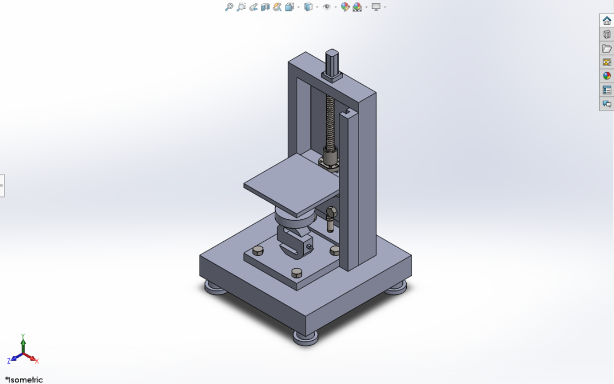

---

### Step 2: Defining the Working Principle

The spring is placed on the fixed lower platform of the machine. The upper moving plate is then moved toward the spring using a motor-driven mechanism.

During the test:

* The motor creates controlled vertical motion.
* The upper moving plate applies force to the spring.
* The load cell measures the applied force.
* The displacement sensor measures spring deformation.
* The collected data is used to calculate spring stiffness and mechanical behavior.

This process makes it possible to analyze the spring under controlled loading conditions.

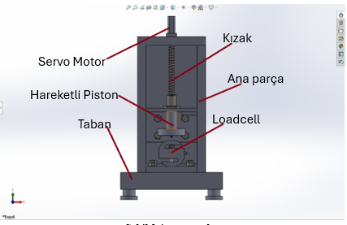

---

### Step 3: Applying Hooke’s Law

Hooke’s law was used as the main theoretical basis for the spring test.

The equation is:

```text
F = k · x
```

Where:

```text
F = Applied force on the spring
k = Spring stiffness coefficient
x = Spring extension or compression amount
```

By measuring the applied force and the deformation, the spring stiffness value can be calculated.

Hooke’s law is important because it helps evaluate:

* Spring stiffness
* Elastic behavior
* Load-deformation relationship
* Spring performance
* Safe working limits

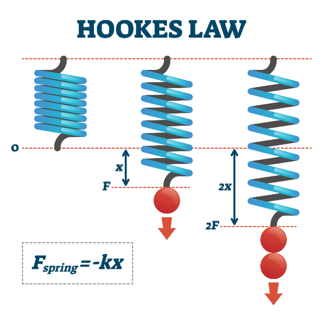

---

### Step 4: Designing the Upper Moving Plate

The upper moving plate is the main part that applies force to the spring during the test.

The plate receives motion from the motor through the motion transmission system and moves vertically along the linear guide system.

The upper moving plate was designed to provide:

* Stable vertical movement
* Accurate force application
* Proper contact with the spring
* Reduced misalignment during testing
* Compatibility with different spring sizes

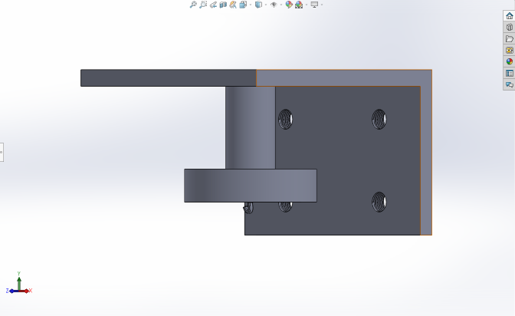

---

### Step 5: Designing the Lead Screw Mechanism

A lead screw mechanism was used to convert the rotary motion of the motor into linear vertical motion.

The motor rotates the screw, and the screw-nut mechanism moves the upper plate up or down.

This mechanism is important because it provides:

* Controlled loading
* Accurate displacement control
* Smooth vertical movement
* Repeatable testing motion
* High positioning precision

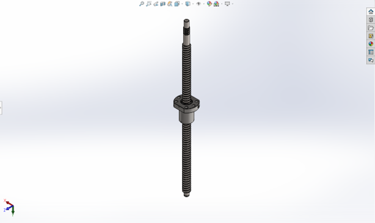

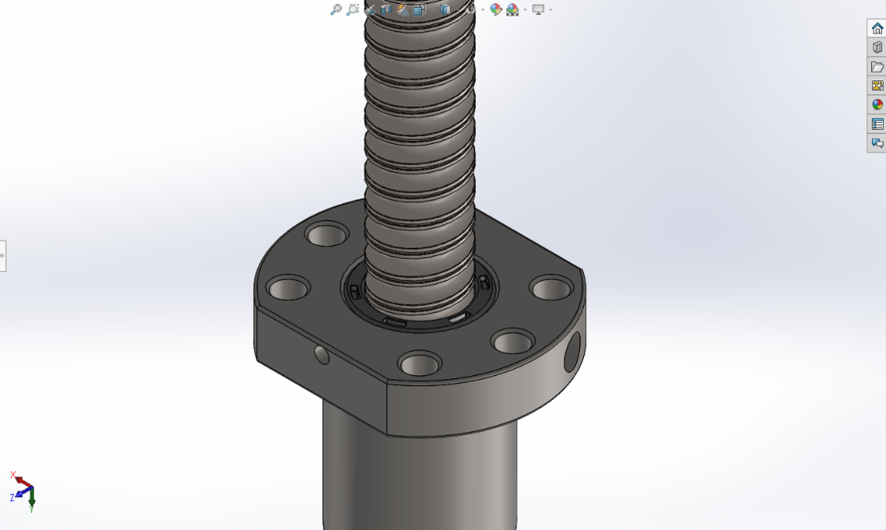

---

### Step 6: Designing the Base Plate

The base plate is the main structural support of the machine.

It carries the machine components and supports the forces generated during the spring test. The base plate also provides the mounting surface for the load cell, spring support, frame, and other components.

The base plate was designed with screw holes to allow accurate assembly of the machine components.

The base plate contributes to:

* Structural stability
* Correct component alignment
* Load distribution
* Safe testing operation
* Easy assembly and maintenance

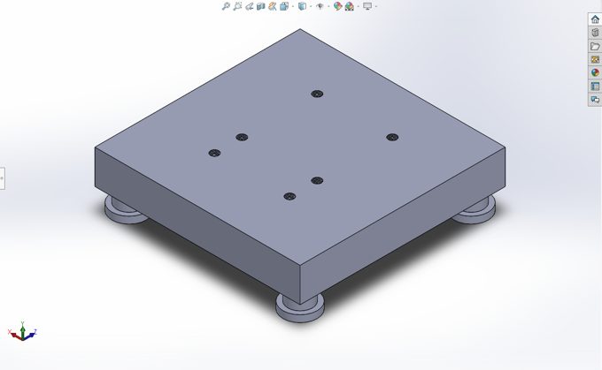

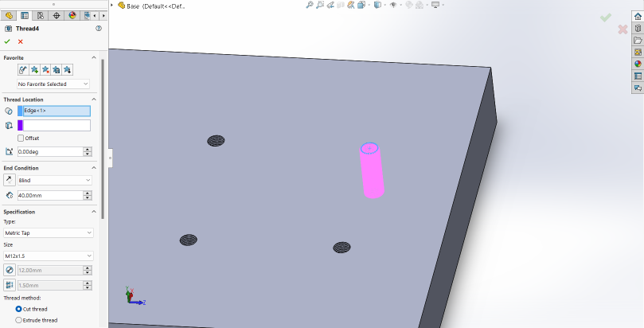

---

### Step 7: Servo / Step Motor Selection

A motor was selected to generate controlled motion for the testing process.

The motor drives the screw mechanism and moves the upper plate vertically. This allows the spring to be compressed or released in a controlled way.

The motor was selected because it provides:

* Precise positioning
* High torque capacity
* Controlled movement
* Feedback capability
* Stable loading motion

The selected motor system is capable of applying approximately **5 kN** of force, which is suitable for the expected spring testing range.

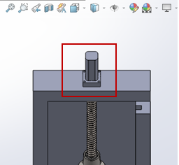

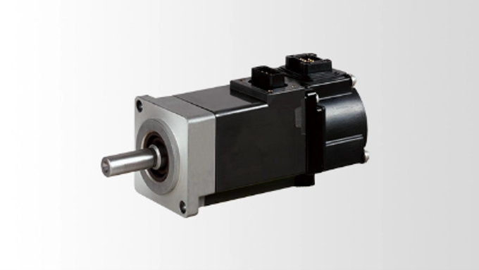

---

### Step 8: Load Cell Selection

A load cell was selected to measure the force applied to the spring during the test.

The selected sensor is an **S-type load cell**, which can measure both tension and compression forces.

The selected load cell has a capacity of approximately:

```text
500 kg ≈ 5 kN
```

The load cell was selected because it provides:

* Accurate force measurement
* Compression and tension measurement capability
* Good mounting flexibility
* Stainless steel structure
* Integration with data acquisition systems

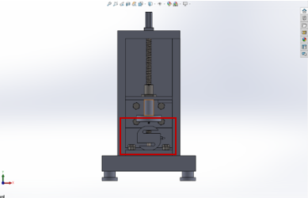

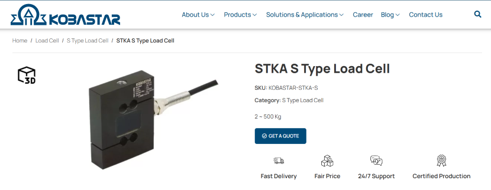

---

### Step 9: Displacement Sensor Selection

A displacement sensor was selected to measure the deformation of the spring.

The sensor measures how much the spring compresses or extends during the test.

The selected sensor provides a measuring range of approximately:

```text
450 mm
```

The displacement sensor was selected because it provides:

* Accurate deformation measurement
* Non-contact measurement capability
* Fast data response
* Easy integration with the system
* Compact structure

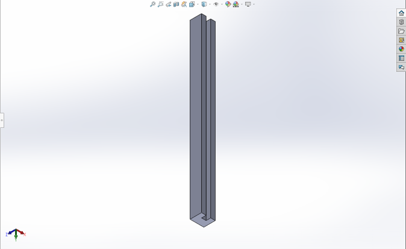

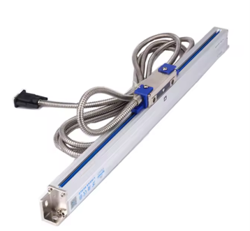

---

### Step 10: Main Frame Design

The main frame is the vertical structural body of the machine.

It supports the motor, linear guide system, displacement sensor, and upper moving plate. The frame must be strong enough to resist the forces generated during testing.

The main frame was designed to provide:

* Vertical alignment
* Structural rigidity
* Support for moving components
* Reduced vibration
* Accurate test results

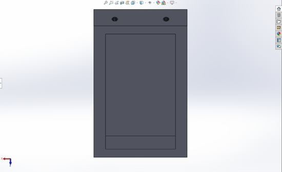

---

### Step 11: Fasteners and Mounting Design

M12 x 1.5 metric bolts were selected to connect the main components of the machine.

These fasteners were selected because they provide:

* High strength
* Secure assembly
* Resistance to vibration
* Stable connection between components
* Suitable performance under vertical loading

The screw holes are planned to be machined using CNC equipment to provide accurate alignment.

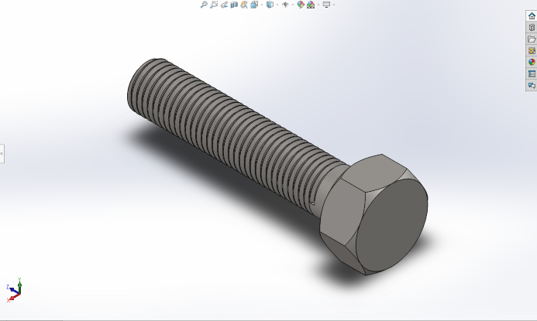

---

### Step 12: Manufacturing Process Planning

A part-by-part manufacturing process was planned for the spring testing machine.

The main manufacturing steps include:

* Producing the base plate by casting or forging
* Machining the base plate using CNC milling
* Drilling M12 x 1.5 mounting holes
* Manufacturing the main frame from steel or aluminum profile
* Producing the upper piston and spring contact part
* Installing the motor, load cell, displacement sensor, and linear guides
* Assembling all components on the base plate
* Calibrating the sensors and testing the system

This manufacturing plan helps ensure correct assembly, mechanical stability, and reliable test operation.

---

## 6. Engineering Analysis Performed

### Spring Behavior Analysis

The spring behavior was analyzed using Hooke’s law:

```text
F = k · x
```

This relationship was used to understand how spring force changes with deformation.

### Force Measurement Analysis

The applied force is measured using the load cell. The force measurement system is important because it allows the machine to determine the actual load applied to the spring during the test.

### Deformation Measurement Analysis

The displacement sensor measures the spring compression or extension. This value is used together with the force measurement to calculate spring stiffness.

### Motion Transmission Analysis

The lead screw mechanism converts rotary motor motion into linear movement. This allows the upper moving plate to compress the spring in a controlled and repeatable way.

### Structural Design Analysis

The base plate and main frame were designed to carry the load generated during testing. The structure must remain stable and rigid to avoid measurement errors.

### Manufacturing Analysis

The manufacturing process was planned by identifying which parts should be produced and which components should be purchased ready-made.

---

## 7. Key Results / System Settings

The key results and design settings of the project were:

* A semi-automated spring testing machine was designed.
* The machine is suitable for testing helical compression springs.
* The system measures force and deformation in real time.
* Hooke’s law was applied to calculate spring stiffness.
* A motor-driven lead screw mechanism was used for controlled motion.
* An S-type load cell was selected for force measurement.
* The load cell capacity is approximately 500 kg or 5 kN.
* A displacement sensor with approximately 450 mm measurement range was selected.
* A strong base plate was designed to support the testing system.
* A main frame was designed to maintain vertical alignment.
* M12 x 1.5 bolts were selected for secure assembly.
* SolidWorks was used for CAD design.
* ANSYS was considered for structural analysis.
* MATLAB was used for calculation and engineering analysis.
* The design is modular and can be adapted for different spring sizes and stiffness values.

---

## 8. Project Images and Explanation

### Spring Testing Machine Overview

This image shows the complete CAD design of the spring testing machine.


---

### Main Components

This image shows the main parts of the spring testing machine, including the servo motor, load cell, moving piston, rail system, main body, and base.


---

### Hooke’s Law

This image represents Hooke’s law, which was used to analyze the relationship between applied force and spring deformation.


---

### Upper Moving Plate

This image shows the upper moving plate that applies force to the spring during the test.


---

### Lead Screw Mechanism

This image shows the lead screw mechanism used to convert motor rotation into linear motion.


---

### Rotating Motion Component

This image shows the rotating component connected to the lead screw mechanism.


---

### Base Plate

This image shows the base plate used to support the system and mount the components.


---

### Screw Hole Detail

This image shows the screw hole detail designed for accurate component mounting.


---

### Servo Motor

This image shows the servo motor location in the CAD model.


This image shows the selected servo motor component.


---

### Load Cell

This image shows the load cell location in the CAD model.


This image shows the selected S-type load cell.


---

### Displacement Sensor

This image shows the displacement sensor CAD model.


This image shows the selected displacement sensor component.


---

### Main Frame

This image shows the main frame of the spring testing machine.


---

### M12 Bolt

This image shows the M12 x 1.5 bolt used for assembly.


---

## 9. Skills Demonstrated

This project demonstrates the following engineering skills:

* Mechanical design
* Machine design
* SolidWorks CAD modeling
* Spring testing system design
* Hooke’s law application
* Load cell selection
* Displacement sensor selection
* Servo/step motor selection
* Lead screw mechanism design
* Force and deformation analysis
* Structural design thinking
* Manufacturing process planning
* CNC machining planning
* Component selection
* Engineering documentation
* Technical report preparation

---

## 10. Project Files

The repository contains the following files:

```text
docs/
└── Spring-Testing-Machine-Report.pdf

images/
├── spring-testing-machine-overview.png
├── main-components-labeled.png
├── hookes-law.png
├── upper-moving-plate.png
├── lead-screw-mechanism.png
├── rotating-motion-component.png
├── base-plate.png
├── screw-hole-detail.png
├── servo-motor-cad.png
├── servo-motor-component.png
├── load-cell-cad.png
├── s-type-load-cell.png
├── displacement-sensor-cad.png
├── displacement-sensor-component.png
├── main-frame.png
└── m12-bolt.png

cad/
├── spring_testing_machine_assembly.SLDASM
└── parts/

analysis/
├── ansys-results/
└── matlab-calculations/

manufacturing/
└── manufacturing-process-notes.md
```

---

## 11. Conclusion

This project successfully presents the design and analysis of a semi-automated spring testing machine.

The system was designed to measure the mechanical behavior of springs by applying controlled force and measuring the resulting deformation. The machine uses a motor-driven lead screw mechanism, a load cell for force measurement, and a displacement sensor for deformation measurement.

Hooke’s law was applied to understand the relationship between force and deformation and to calculate spring stiffness. The design also includes a strong base plate, a main frame, an upper moving plate, and secure M12 x 1.5 fasteners to ensure stability during testing.

This project helped develop practical understanding in mechanical design, spring testing, force measurement, displacement measurement, CAD modeling, manufacturing planning, and engineering analysis.
